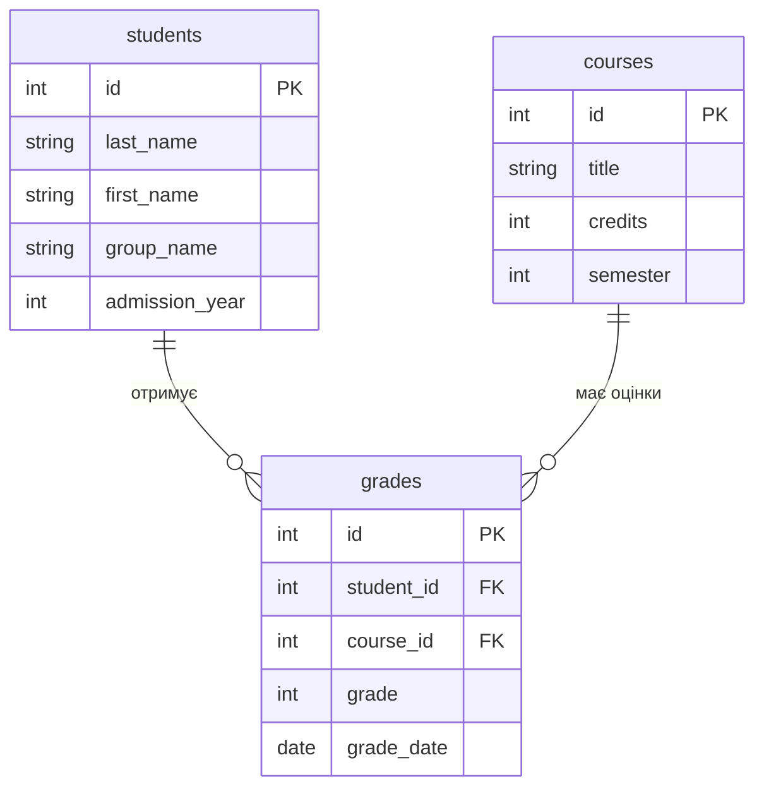

# Практична робота №3
## Створення ER-діаграми для заданого прикладу

**Варіант: 9 — Університет (деканат)**

---

## Завдання 1. ER-діаграма повної схеми



У схемі є дві вимірні таблиці — `students` і `courses`, та одна фактова таблиця — `grades`. Таблиця `grades` з'єднує студентів і курси за допомогою двох зовнішніх ключів.

---

## Завдання 2. Тип кожного зв'язку

### `students` — `grades`

Це зв'язок **1:N**. Один студент може мати багато оцінок з різних курсів, але кожна конкретна оцінка належить одному студенту.

### `courses` — `grades`

Це зв'язок **1:N**. Один курс може мати багато оцінок різних студентів, але кожна конкретна оцінка стосується одного курсу.

Отже, обидва зв'язки в цій схемі мають тип **1:N**.

---

## Завдання 3. Первинні й зовнішні ключі

### Таблиця `students`

- Первинний ключ: `id`.
- Зовнішніх ключів немає.

### Таблиця `courses`

- Первинний ключ: `id`.
- Зовнішніх ключів немає.

### Таблиця `grades`

- Первинний ключ: `id`.
- Зовнішній ключ: `student_id` → `students.id`.
- Зовнішній ключ: `course_id` → `courses.id`.

Таким чином, `grades` має власний первинний ключ і два зовнішні ключі, які пов'язують її з двома вимірними таблицями.

---

## Завдання 4. Якщо додати ще одну сутність

До предметної області університету можна додати сутність **викладачі** — `teachers`.

Нова таблиця може мати такі стовпці:

```text
teachers(
    id,
    last_name,
    first_name,
    department
)
```

Один викладач може проводити багато курсів, а кожен курс у цій моделі закріплений за одним викладачем. Тому між `teachers` і `courses` буде зв'язок **1:N**.

У таблиці `courses` для цього можна додати зовнішній ключ `teacher_id`, який посилається на `teachers.id`.

---

## Завдання 5. Порівняння з прикладом

Моя діаграма університету структурно схожа на діаграму хімчистки з прикладу. В обох випадках є дві вимірні таблиці та одна фактова таблиця.

У моєму варіанті це `students`, `courses` і `grades`, а в прикладі — `services`, `clients` і `orders`. Фактова таблиця в обох схемах має два зовнішні ключі та з'єднує дві вимірні таблиці. Обидва зв'язки мають тип **1:N**, а вимірні таблиці не пов'язані одна з одною безпосередньо.

---

# Контрольні питання

### 1. Чим логічна модель відрізняється від концептуальної, і чим фізична — від логічної?

Концептуальна модель описує предметну область на загальному рівні та показує основні сутності й зв'язки між ними. Логічна модель детальніше описує таблиці, стовпці, ключі та зв'язки, але ще не залежить від конкретної СУБД. Фізична модель показує реальну реалізацію бази даних у конкретній СУБД: типи даних, обмеження, індекси та інші технічні особливості.

### 2. Чому зв'язок M:N не можна реалізувати двома зовнішніми ключами в одній із двох основних таблиць?

При зв'язку M:N один запис першої таблиці може бути пов'язаний з багатьма записами другої, і навпаки. Два зовнішні ключі в одній таблиці не дозволяють зберігати довільну кількість таких зв'язків. Тому створюють окрему проміжну таблицю, яка містить зовнішні ключі на обидві основні таблиці.

### 3. Що означають `||`, `o{`, `|{` у синтаксисі Mermaid `erDiagram`?

`||` означає «рівно один». `o{` означає «нуль або багато». `|{` означає «один або багато».

Наприклад, запис `A ||--o{ B` читається як: «один запис A може бути пов'язаний з нулем або багатьма записами B». Це зв'язок типу **1:N**.
